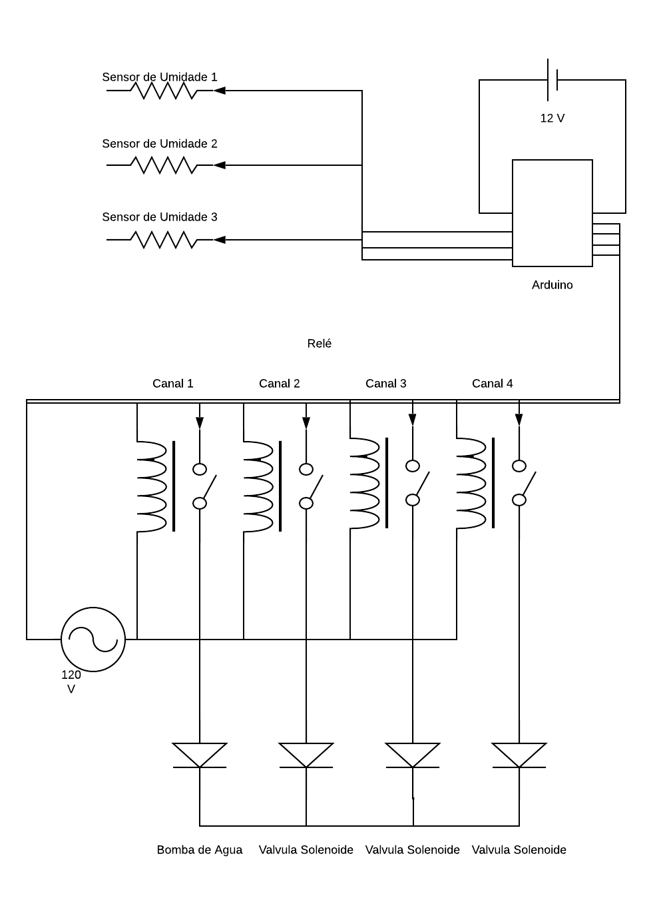

# irrigacao-ifsuldeminas
Projeto Integrador - Biologia

### Materiais Necessários
- 1 Unidade – Arduino Uno
- 1 Unidade – Sensor de umidade de solo
- 1 Unidade – Módulo Relé 5V
- 1 Unidade – Jumper Macho Macho
- 1 Unidade – Jumper Macho Fêmea
- 1 Unidade – Válvula solenoide para água 12V VA 05
- 1 Unidade – Fonte 12V/1A
- 1 Unidade – Adaptador P4 fêmea
- 1 Unidade – Mangueira
### Preços das peças site("https://www.eletrogate.com")

- Preço:R$:8,90 – Sensor de umidade de solo
- Preço:R$:24,90 – Módulo Relé 5V
- Preço:R$:49,90  – Válvula solenoide para água 12V VA 05
- Preço:R$:12,90  – Fonte 12V/1A
- Preço:R$:9,90  – Adaptador P4 fêmea
- Preço:R$:36,00 – Mangueira("https://produto.mercadolivre.com.br/MLB-1164882887-mangueira-30m-casa-e-jardim-12-duplo-revest-30-metros-_JM?quantity=1#position=5&type=item&tracking_id=f9a1a9b5-bf0b-4f39-9142-3a045eb77196")

### Circuito em Fritzing

### Visão Geral

